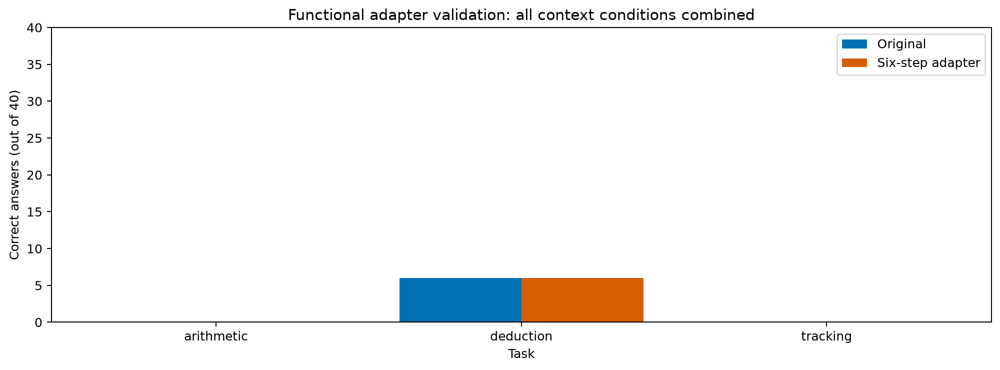
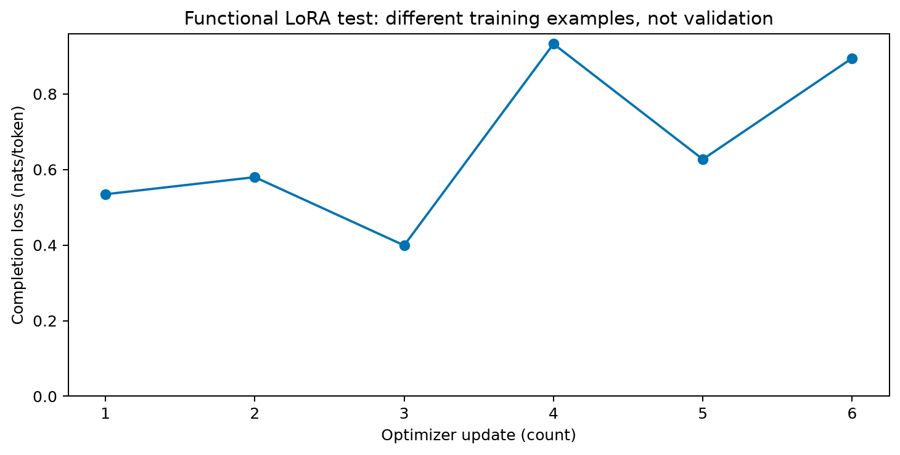

# Primeiro ciclo completo de treino e validação v2.1

## Resultado

Após seis atualizações LoRA, o modelo permaneceu em **6/120 respostas corretas**, sem nenhuma transição acerto→erro ou erro→acerto em relação ao original. O conjunto de evidências foi exatamente correto em 10/120 casos, contra 9/120 antes. Isso não demonstra melhora de raciocínio ou robustez.

O objetivo funcional foi cumprido: treinar nos dados revisados, verificar pesos-base intactos, recarregar o adaptador e avaliar dados que não participaram das atualizações. O [protocolo](adapter-validation-protocol.md) foi registrado antes de rodar; a baixa competência inicial já era conhecida. Não ampliamos o orçamento após observar o resultado.

| Tarefa | Limpo antes/depois | Não relacionado | Numérico | Similar |
|---|---|---|---|---|
| Aritmética | 0/10 → 0/10 | 0/10 → 0/10 | 0/10 → 0/10 | 0/10 → 0/10 |
| Dedução | 3/10 → 3/10 | 1/10 → 1/10 | 2/10 → 2/10 | 0/10 → 0/10 |
| Acompanhamento | 0/10 → 0/10 | 0/10 → 0/10 | 0/10 → 0/10 | 0/10 → 0/10 |

As categorias de acerto ficaram iguais; isso não significa que todos os textos produzidos foram idênticos. A evidência adicional correta ocorreu em acompanhamento/limpo, que passou de 1/10 para 2/10. Ambos tiveram 0/120 formatos estritos aceitos, 113/120 respostas legíveis e 112/120 conjuntos de IDs válidos. Rejeições permanecem no denominador.

## Treinamento realizado

- Dados v2.1 `b142fe60ba9cd6a5`; execução `aa1bb31bbe1b6c28`.
- Código executado: `646fa00`; configuração completa no manifesto.
- Qwen2.5-1.5B-Instruct BF16, revisão `989aa7980e4cf806f80c7fef2b1adb7bc71aa306`.
- LoRA rank 4, alpha 8, q_proj/v_proj, dropout zero, AdamW, taxa 0,0001, seed 42.
- Seis exemplos: primeiro problema-base de **treino** de cada tarefa nas condições limpa e similar; 170 tokens supervisionados no total. Máscara exclui prompt da perda.
- 544.768 parâmetros treináveis; pesos-base congelados e verificados por hash.
- Perda na mesma sonda de treino: 0,534521 → 0,493718. Não é perda de validação.
- Tempo somado das atualizações: 1,75 s; não inclui carregar modelo, sondas, hashing e checkpoints.
- Pico alocado: 3.658.595.840 bytes; reservado: 4.647.288.832 bytes.
- Recarga em modelo-base novo: diferença máxima de logits zero na sonda.

Esta execução foi contínua; não repetimos nela o ensaio de interrupção/retomada já documentado na v2. Não inferir que seis exemplos representam um treinamento completo.

## Avaliação e proveniência

Inferência do adaptador: `1388c1f4d0e24a2b`; baseline: `145ba1dd1550430d`. Mesmos 120 exemplos de validação, prompt, geração gulosa, seed, revisão, BF16, GPU e limites. Os commits diferem pela adição do carregador de adaptador; o caminho original de geração não foi modificado. A comparação verifica identidade dos dados, configurações e runtime comum, preservando os hashes de ambas as versões de código.

O manifesto da inferência registra o SHA-256 dos pesos, configuração do adaptador e manifesto de treinamento. Não usa apenas o nome da pasta como identidade. Isso evita retomar respostas de outro adaptador por engano.

Todas as 120 gerações terminaram por EOS, sem atingir limites. Houve 3.615 tokens novos e 179,63 s de geração; pico alocado de 3.157.906.944 bytes e reservado de 3.370.123.264 bytes. O baseline levou 140,52 s. Uma única execução por configuração não permite concluir uma diferença estável de velocidade; o adaptador não foi fundido aos pesos-base.

## Artefatos e reprodução

- [Treinamento: manifesto, histórico e resumo](../reports/2026-09-28/lora-v21-functional/).
- [Validação: respostas brutas e dados avaliados](../reports/2026-09-28/1388c1f4d0e24a2b/).
- [Métricas de formato, conteúdo e evidências](../reports/2026-09-28/1388c1f4d0e24a2b-content-v2/comparison.json).
- [Comparação por exemplo, grupo e hashes dos arquivos](../reports/2026-09-28/adapter-v21-comparison/).

```powershell
poetry run python -m foco_llm.train_smoke data/benchmark-v21/2026-09-28/b142fe60ba9cd6a5/dataset.json --revision 989aa7980e4cf806f80c7fef2b1adb7bc71aa306 --output data/training-v21/2026-09-28
poetry run python -m foco_llm.evaluate_adapter data/benchmark-v21/2026-09-28/b142fe60ba9cd6a5/dataset.json data/training-v21/2026-09-28/aa1bb31bbe1b6c28/step-0006 --revision 989aa7980e4cf806f80c7fef2b1adb7bc71aa306 --output data/adapter-validation/2026-09-28
poetry run python scripts/export_baseline.py data/benchmark-v21/2026-09-28/b142fe60ba9cd6a5/dataset.json data/adapter-validation/2026-09-28/1388c1f4d0e24a2b reports/2026-09-28/1388c1f4d0e24a2b
poetry run python scripts/evaluate_content.py reports/2026-09-28/1388c1f4d0e24a2b reports/2026-09-28/1388c1f4d0e24a2b-content-v2
poetry run python scripts/compare_adapter.py reports/2026-09-28/145ba1dd1550430d reports/2026-09-28/1388c1f4d0e24a2b reports/2026-09-28/adapter-v21-comparison
```

Os IDs dependem de código, configuração e ambiente; em outra versão, usar o diretório retornado. O adaptador permanece local. Os quatro arquivos públicos de treinamento são cópias do manifesto, resumo, histórico e gráfico da execução identificada; não há pesos ou estado do otimizador no GitHub.





## O que falta para o estudo

O portão de publicação inicialmente bloqueou os hashes de integridade em dois arquivos como possíveis segredos. A inspeção confirmou campos de proveniência; a regra foi ajustada para campos completos com SHA-256 hexadecimal, com testes de regressão para comprimentos inválidos e conteúdo adicional. Nenhum bloqueio foi contornado e nenhum resultado foi alterado para passar na verificação.

Nenhuma tarefa atingiu 8/10 na condição limpa. O próximo experimento deve separar dificuldade, ordem e formato, com critérios prévios e sem selecionar apenas itens acertados. Depois vêm controles C1/C2/C3, orçamento maior definido previamente, repetições por semente, incerteza e transferência entre tarefas. Um modelo maior poderá ajudar a avaliar se há efeito de capacidade, mas não elimina os controles.

Não houve execução na nuvem, abertura do teste final, atualização do artigo ou criação da apresentação. Ainda não temos resultados suficientes para sustentar o título amplo de generalização entre tarefas; o [guia](experiment-guide.md) explicita os critérios para essa conclusão.
