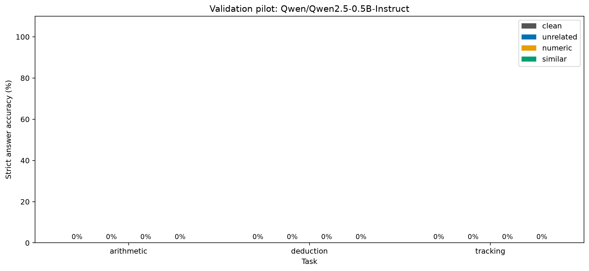

# Baseline local de validação — 27/09/2026

## Resultado principal

O Qwen2.5-0.5B-Instruct gerou 120 respostas na GPU local. **Nenhuma passou no contrato de JSON puro:** todas começaram com um bloco Markdown. Consequentemente, a acurácia estrita foi zero nas três tarefas e nas quatro condições. Isso mede uma falha de adesão ao formato; não demonstra que todas as respostas contidas nos blocos estavam erradas.

Não foram removidas cercas Markdown para recalcular pontuações. As respostas originais permanecem disponíveis para auditoria, e o próximo protocolo deverá ser definido explicitamente antes de comparar modelos ou treinamentos.

## Configuração e recursos medidos

| Item | Registro |
|---|---|
| Código executado | `c7c272c` |
| Execução | `5fab79eb7f10fc4d` |
| Modelo | `Qwen/Qwen2.5-0.5B-Instruct` |
| Revisão | `7ae557604adf67be50417f59c2c2f167def9a775` |
| GPU | RTX 3060 Laptop, 6 GB |
| Software | PyTorch 2.8.0+cu128; Transformers 4.57.3 |
| Precisão e atenção | FP16; eager |
| Geração | Gulosa; seed 42; lote 1; até 128 tokens novos |
| Dados | 120 exemplos de validação, 30 problemas-base |
| Estratos | 10 exemplos por tarefa/condição |
| Respostas geradas / aceitas | 120 / 0 |
| Encerramento | 120 por EOS; 0 por limite de tokens ou tempo |
| Tempo acumulado de geração | 175,88 s |
| Tokens gerados | 5.213 |
| Pico alocado pelo PyTorch | 1.039.616.512 bytes (aproximadamente 991,5 MiB) |
| Pico reservado pelo PyTorch | 1.080.033.280 bytes (1.030 MiB) |

O tempo soma a geração de cada exemplo, incluindo os cinco checkpoints preservados da sessão anterior. Não inclui pausa, downloads, carregamento, tokenização nem gravação. A memória é a do alocador PyTorch, não todo o uso da GPU. Tempos por exemplo e timestamps UTC constam nas respostas brutas.

## Métricas e gráficos

| Tarefa | Limpa | Sem relação | Numérico | Similar |
|---|---:|---:|---:|---:|
| Aritmética | 0/10 | 0/10 | 0/10 | 0/10 |
| Dedução | 0/10 | 0/10 | 0/10 | 0/10 |
| Acompanhamento de objetos | 0/10 | 0/10 | 0/10 | 0/10 |

**Todos os zeros incluem rejeições por formato.** A diferença limpa versus distraída também é zero, mas não é evidência de robustez: o instrumento perdeu o sinal da tarefa. A taxa de falha condicionada ao acerto limpo é indefinida, porque não houve resposta aceita e correta na condição limpa.



O [gráfico de dispersão](../reports/2026-09-27/5fab79eb7f10fc4d/paired-accuracy.png) tem todos os pontos na origem e sobrepostos. Ele é preservado como saída do protocolo, mas não permite comparar tarefas nesta execução.

## Artefatos e reprodução

O diretório [reports/2026-09-27/5fab79eb7f10fc4d](../reports/2026-09-27/5fab79eb7f10fc4d) contém manifesto, respostas brutas, exemplos de validação, previsões aceitas, relatório, resumo de recursos, auditoria de formato e gráficos. São dados sintéticos. Os exemplos de teste não estão nessa exportação.

O dataset completo é reproduzido com seed 42 e 100 problemas por tarefa. Seu SHA-256 é `969659029e986d866b0d531938c77e24fce0493c92a3680822f6f34f6d1c0a4f`. Para reproduzir exatamente o código de inferência, use o commit registrado acima; versões posteriores podem alterar a identidade da execução.

```powershell
poetry install --with inference
poetry run python -m foco_llm prepare --seed 42 --problems-per-task 100
$latestRun = Get-Content data/processed/latest.json -Raw | ConvertFrom-Json
$datasetPath = Join-Path (Join-Path 'data/processed' $latestRun.path) 'dataset.json'
poetry run python -m foco_llm.inference $datasetPath --revision 7ae557604adf67be50417f59c2c2f167def9a775 --output data/inference/2026-09-27
```

No código atual, a exportação auditada é reproduzida por:

```powershell
poetry run python scripts/export_baseline.py $datasetPath data/inference/2026-09-27/5fab79eb7f10fc4d reports/2026-09-27/5fab79eb7f10fc4d
```

O exportador confere que as previsões aceitas correspondem às respostas brutas e recalcula as métricas antes de publicar. Arquivos existentes com conteúdo diferente são recusados. Alterações de hardware ou bibliotecas podem afetar saídas e desempenho, mesmo com seed fixa.

## Decisão para a próxima etapa

Antes do ajuste, versionar uma avaliação que relate separadamente adesão ao JSON puro e acerto de conteúdo. A recomendação é aceitar, em uma métrica adicional explicitamente identificada, apenas um objeto JSON completo ou esse mesmo objeto dentro de um único bloco Markdown completo, sem extrair respostas de prosa nem consertar valores. Aplicar a mesma regra a todos os modelos e controles e manter a métrica estrita para comparação.

Essa recomendação ainda não foi implementada nem usada para pontuar esta execução. O piloto usa apenas dez problemas-base por tarefa, uma semente e templates compartilhados; não há evidência de generalização entre tarefas, efeito do tamanho do modelo ou benefício de treinamento. O teste final segue reservado, e o artigo não foi alterado.
