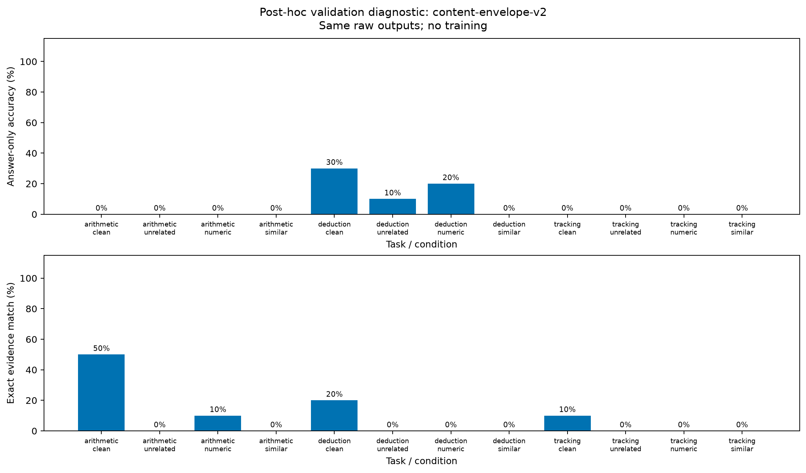
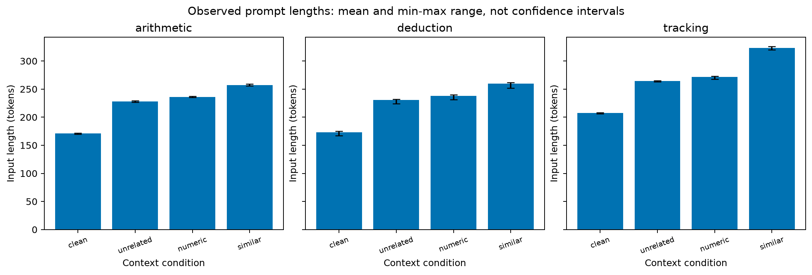

# Baseline no conjunto v2.1 — 2026-09-28

## Resultado e decisão

O Qwen2.5-1.5B-Instruct original, sem adaptador, acertou **6/120 respostas (5%)** pelo protocolo `content-envelope-v2`, mantendo todas as rejeições no denominador. Nenhuma tarefa atingiu o critério exploratório prévio de 8/10 acertos na condição limpa. Este baseline não oferece competência inicial suficiente para atribuir falhas especificamente aos distratores. Os dados e resultados ficam preservados; não foi iniciado treinamento de eficácia com base nessa execução.

| Tarefa | Limpo | Não relacionado | Numérico | Similar |
|---|---:|---:|---:|---:|
| Aritmética | 0/10 | 0/10 | 0/10 | 0/10 |
| Dedução | 3/10 | 1/10 | 2/10 | 0/10 |
| Acompanhamento | 0/10 | 0/10 | 0/10 | 0/10 |

São 30 problemas-base com quatro variantes dependentes. Zero diferença entre condições em tarefas com zero acertos é efeito de piso, não evidência de robustez. Em dedução, limpo→não relacionado perdeu dois acertos e recuperou zero; limpo→numérico perdeu dois e recuperou um; limpo→similar perdeu três e recuperou zero. Os denominadores são pequenos: apenas três acertos limpos permitem observar essas perdas.

## Formato e evidências

Todas as 120 saídas começaram com bloco Markdown, portanto nenhuma cumpriu o contrato estrito de JSON puro. A análise de conteúdo aceita um único bloco completo, sem corrigir respostas: 113 respostas legíveis e 112 com identificadores válidos. Sete rejeições de schema ocorreram em aritmética/similar; uma rejeição de evidência desconhecida ocorreu em dedução/limpo. A pontuação zero de formato não explica os baixos acertos de conteúdo.

Houve 9/120 conjuntos de evidências exatamente corretos: aritmética/limpo 5, aritmética/numérico 1, dedução/limpo 2 e acompanhamento/limpo 1. Acertar as evidências declaradas não demonstra um mecanismo interno de raciocínio.

Exemplos inspecionados, sem alterar o avaliador:

- Aritmética `000008:clean`: resposta `10`, gabarito `47`, embora tenha listado todos os fatos relevantes.
- Dedução `000008:clean`: resposta correta `P2134`, mas omitiu a evidência `F5`.
- Acompanhamento `000008:clean`: respondeu `F4`, um identificador de fato, em vez da localização `B7771`.
- Aritmética `000018:similar`: devolveu o número JSON `70` em vez de uma string; rejeitado pelo contrato já fixado.

## Comprimento e custo

Médias de tokens de entrada, incluindo o template de conversa:

| Tarefa | Limpo | Não relacionado | Numérico | Similar |
|---|---:|---:|---:|---:|
| Aritmética | 171,3 | 228,3 | 236,1 | 257,4 |
| Dedução | 173,4 | 230,4 | 238,0 | 259,8 |
| Acompanhamento | 207,2 | 264,2 | 271,5 | 323,3 |

Igualar a quantidade de frases não igualou tokens. O gráfico mostra média e mínimo–máximo observados, não intervalos de confiança. As entradas tiveram no máximo 326 tokens, abaixo do limite de 1.024. Todas as gerações terminaram por EOS; nenhuma atingiu limite de tokens ou tempo. Foram 3.559 tokens de saída, 140,52 segundos de geração, pico alocado de 3.155.727.872 bytes e reservado de 3.370.123.264 bytes. Tempo exclui carregamento e operações externas à geração; memória é a medida pelo PyTorch.

## Proveniência e reprodução

- Protocolo definido antes da execução: [v2.1](benchmark-v21-protocol.md).
- Execução: `145ba1dd1550430d`; código: `cd2b7be`.
- Dados: `b142fe60ba9cd6a5a6f95f1a1ac7adfc7fff8717d1ec5789639397966b7d789e`.
- Modelo: revisão `989aa7980e4cf806f80c7fef2b1adb7bc71aa306`, BF16, RTX 3060 Laptop, eager, seed 42, geração gulosa, máximo de 128 tokens novos.
- [Respostas brutas, validação e manifesto](../reports/2026-09-28/145ba1dd1550430d/).
- [Métricas de conteúdo e transições](../reports/2026-09-28/145ba1dd1550430d-content-v2/comparison.json).
- [Estatísticas e hashes de entrada](../reports/2026-09-28/145ba1dd1550430d-tokens/token-statistics.json).

```powershell
poetry run python scripts/export_baseline.py data/benchmark-v21/2026-09-28/b142fe60ba9cd6a5/dataset.json data/inference-v21/2026-09-28/145ba1dd1550430d reports/2026-09-28/145ba1dd1550430d
poetry run python scripts/evaluate_content.py reports/2026-09-28/145ba1dd1550430d reports/2026-09-28/145ba1dd1550430d-content-v2
poetry run python scripts/summarize_tokens.py reports/2026-09-28/145ba1dd1550430d reports/2026-09-28/145ba1dd1550430d-tokens
```





## Próxima decisão experimental

Recomenda-se um diagnóstico de competência limpa que varie separadamente profundidade, ordem e formato de resposta, com orçamento e critérios fixados antes da execução. Isso exige um protocolo próprio; nenhuma dessas alterações foi aplicada aqui. Escolher somente exemplos que o modelo acertou produziria viés de seleção. O teste final permanece reservado.

O baseline v1 não é controle direto desta versão: os problemas mudaram. O teste funcional LoRA anterior também não mede melhora nesta validação. Permanecem pendentes treinamento controlado, repetição de sementes, intervalos de confiança, comparação local/nuvem e artigo.
