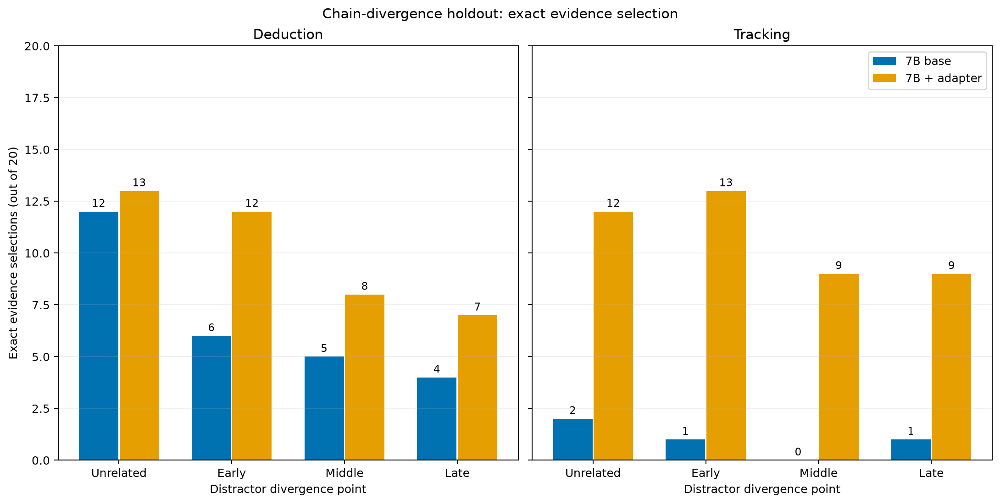

# Resultado: divergência controlada da cadeia distratora

Fonte: [notebook Kaggle, versão 2, execução concluída](https://www.kaggle.com/code/matheusdsousaribeiro/kaggle-chain-divergence-7b/output?scriptVersionId=356460561).
A execução levou 25 min 16 s na GPU T4 x2. O código foi obtido do commit
`68bbc94dc0d4672231820d2d42a6e6d428b533a7`. O conjunto congelado contém
160 casos derivados de 40 bases (20 por tarefa), SHA-256
`a17296b912c661efb90da2231257ceb9b8facc3cb87ee60de4c2e9a0fc530036`.
Os 160 gabaritos passaram pelo resolvedor simbólico. Os números abaixo foram
conferidos no `comparison.json` salvo no Kaggle e transcritos para
`reports/2026-10-08/chain-divergence-summary.json`; os textos brutos das
gerações permanecem no output da mesma execução.

## Seleção exata de evidências

Cada célula representa acertos em **20 perguntas**; o mesmo problema-base
aparece nos quatro braços, portanto os 160 casos não são 160 unidades
independentes. `Sem relação` usa quatro frases sem vínculo com a cadeia;
`cedo`, `meio` e `tarde` indicam em qual salto a cadeia de outro objeto
deixa de repetir os nomes dos nós da cadeia correta.

| Tarefa e modelo | Sem relação | Cedo | Meio | Tarde | Total / 80 |
| --- | ---: | ---: | ---: | ---: | ---: |
| Dedução, 7B base | 12 | 6 | 5 | 4 | 27 |
| Dedução, adaptador | 13 | 12 | 8 | 7 | 40 |
| Rastreamento, 7B base | 2 | 1 | 0 | 1 | 4 |
| Rastreamento, adaptador | 12 | 13 | 9 | 9 | 43 |

Somando as duas tarefas, o 7B base selecionou os quatro fatos corretos em
31/160 casos; o mesmo modelo com o adaptador de dedução fez isso em 83/160.
Todos os 320 retornos respeitaram o formato de seleção (`valid=20` em cada
uma das 16 combinações de modelo, tarefa e braço). A comparação usa o mesmo
prompt e conjunto de teste; o adaptador já havia sido treinado antes deste
holdout e **não** foi reajustado aqui.

## Interpretação

Em dedução, o número de seleções exatas cai conforme o distrator compartilha
mais nomes de nós com a cadeia correta: 6→5→4 no 7B base e 12→8→7 com o
adaptador. É um padrão descritivo, não uma demonstração de efeito causal
geral ou significância estatística. Em rastreamento, a sequência não é
monótona: o adaptador obteve 13→9→9. O 7B base acertou apenas 2/20 no
controle sem relação de rastreamento; esse *efeito de piso* impede concluir
como a posição do desvio o afeta nessa tarefa.

O conjunto foi desenhado depois dos resultados fora do molde anteriores e
usa cadeias de três saltos com relações explicitamente associadas ao objeto.
Por isso, ele é um teste **exploratório de generalização** e não substitui
aquele holdout mais difícil. As diferenças entre base e adaptador são
observações nesse checkpoint, prompt e seed; faltam replicações para estimar
estabilidade. A seleção dos IDs é uma resposta externa, não uma leitura das
ativações ou do raciocínio interno do modelo. O artigo deve apresentar esses
limites ao lado da tabela e do gráfico.

O gráfico é reproduzível com
`poetry run python scripts/plot_chain_divergence.py --input reports/2026-10-08/chain-divergence-summary.json --output reports/2026-10-08/chain-divergence-7b.png`.
