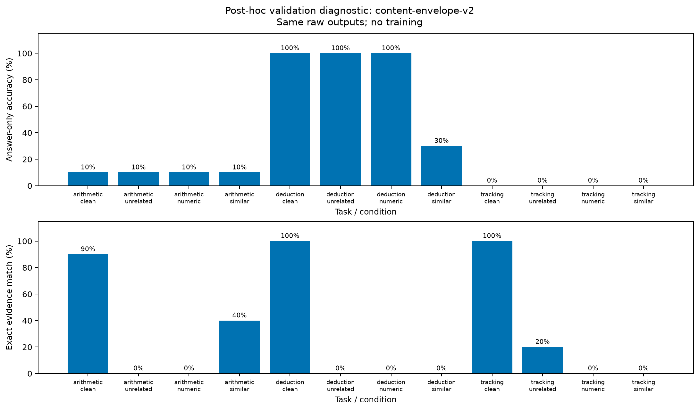

# Formato, resposta e evidências — diagnóstico de validação

## O que mudou

As mesmas 120 respostas do baseline foram analisadas novamente, sem executar o modelo ou ajustar pesos. O baseline estrito original foi preservado e recalculado para verificar consistência. Esta é uma **análise posterior dos dados de validação**, motivada pela falha de formato já observada; não é uma confirmação independente nem uma melhora do modelo.

O protocolo `content-envelope-v2` separa três leituras:

1. **Estrita:** mantém o parser original, que exige JSON puro e identificadores de evidências válidos.
2. **Conteúdo com evidências válidas:** aceita o mesmo objeto JSON puro ou dentro de um único bloco completo, com abertura de três crases seguida de `json` ou sem linguagem, quebra de linha e fechamento isolado. Rejeita prosa externa, blocos múltiplos/incompletos, chaves duplicadas, campos extras, valores de tipos errados e evidências inexistentes/repetidas.
3. **Resposta independente:** exige o mesmo objeto e schema válidos da leitura adicional, mas avalia o campo `answer` mesmo quando os identificadores em `evidence` são inválidos. Não interpreta nem corrige a resposta. As evidências são avaliadas separadamente.

O denominador continua sendo **120 exemplos**, inclusive rejeitados; não se calcula acurácia apenas entre as saídas aceitas. A comparação de respostas mantém a normalização anterior de espaços nas extremidades e caixa, sem converter números ou remover explicações.

## Resultados observados

| Medida | Resultado |
|---|---:|
| Saídas aceitas pelo contrato estrito | 0/120 |
| Objetos legíveis pela regra adicional | 120/120 |
| Objetos com identificadores de evidência válidos | 102/120 |
| Rejeições por identificadores inexistentes | 18/120 |
| Acertos exigindo também identificadores válidos | 22/120 (18,3%) |
| Acertos da resposta, independentes dos identificadores | 37/120 (30,8%) |
| Seleção de evidências exatamente igual ao gabarito | 35/120 (29,2%) |

“Identificadores válidos” significa que existem no enunciado, não que são os fatos certos. A resposta independente não exige seleção correta de evidências. O uso de evidências fornecidas pelo modelo também não demonstra quais fatos ele utilizou internamente.

### Acerto da resposta independente

Cada célula tem dez exemplos. As variantes de um mesmo problema são pareadas.

| Tarefa | Limpa | Sem relação | Numérico | Similar |
|---|---:|---:|---:|---:|
| Aritmética | 1/10 | 1/10 | 1/10 | 1/10 |
| Dedução | 10/10 | 10/10 | 10/10 | 3/10 |
| Acompanhamento de objetos | 0/10 | 0/10 | 0/10 | 0/10 |

Em dedução com distrator similar houve **sete transições de acerto para erro** e nenhuma de erro para acerto, uma queda observada de 70 pontos percentuais. A amostra é pequena e usa templates simples; não há intervalo de confiança nem confirmação em outro conjunto. Não generalizar esse valor para LLMs em geral.

Nas condições de dedução sem relação e numérica, as respostas estavam corretas, mas parte das evidências usava nomes de propriedades ou frases, em vez de IDs `F1`, `F2` etc. Se a resposta fosse descartada junto com a evidência, pareceria haver queda de raciocínio onde esta leitura encontrou erro de referência.

Em aritmética e acompanhamento de objetos, o desempenho já é baixo na condição limpa. A ausência de queda adicional não demonstra resistência a distratores: há um efeito de piso. A próxima versão do experimento precisa de tarefas ou modelos com competência inicial suficiente para medir degradação.



Exemplos auditáveis: em `arithmetic-000008:clean`, a resposta foi `19` e o alvo era `48`; em `tracking-000008:clean`, foi `B614` e o alvo `B110`. Em `deduction-000008:unrelated`, `C615` estava correto, mas as evidências eram `P197` e `P541`, que não são identificadores de fatos. As respostas brutas ficam no [baseline original](../reports/2026-09-27/5fab79eb7f10fc4d/raw-responses.json).

## Reprodução e auditoria

```powershell
poetry install
poetry run python scripts/evaluate_content.py reports/2026-09-27/5fab79eb7f10fc4d reports/2026-09-27/5fab79eb7f10fc4d-content-v2
```

Essa análise não exige GPU, download nem rede. O script verifica IDs e hashes dos prompts, recusa conjuntos incompletos/duplicados e exige que o relatório estrito recalculado coincida com o original. O manifesto contém hashes dos arquivos de entrada. Publicações diferentes não sobrescrevem resultados existentes.

O [comparativo completo](../reports/2026-09-27/5fab79eb7f10fc4d-content-v2/comparison.json) contém as decisões por exemplo, relatórios estrito, de conteúdo e de resposta independente. Em `answer_only`, somente contagens, acurácia e transições são pertinentes: os campos de métricas de evidências são zero por construção porque a visão usa evidência vazia, não representam a seleção produzida pelo modelo. Para evidências, usar `content.groups`.

Foi preservada também a exportação intermediária `content-envelope-v1`, que ainda condicionava o acerto à validade dos identificadores (22/120). Seus relatórios `strict` e `content` coincidem com as mesmas seções da v2; a v2 acrescenta a visão independente e é a versão vigente. Não confundir 22→37 acertos entre métricas com ganho por treinamento.

## Próxima decisão experimental

Antes de treinar, revisar dificuldade e diversidade dos dados e medir competência limpa em uma configuração apropriada. Congelar o protocolo de formato/resposta/evidências antes de comparar controles. Registrar explicitamente se o objetivo do ajuste é melhorar cálculo, seleção de fatos ou ambos. A avaliação final permanece reservada; ainda não houve treinamento, comparação de tamanhos nem teste de transferência.
