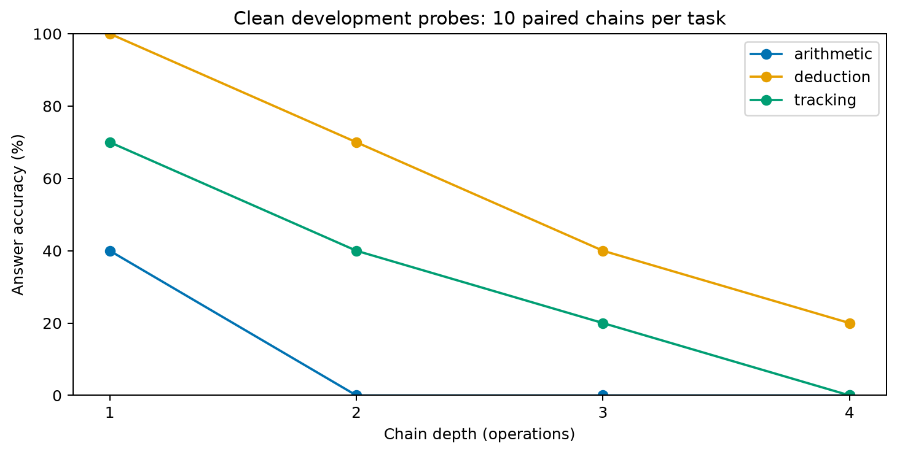

# Diagnóstico local de profundidade — 29/09/2026

Foram concluídas 120 inferências novas, sem treinamento: três tarefas, dez cadeias
por tarefa e quatro profundidades. Cada célula abaixo contém dez casos. Todos
os 120 retornaram respostas aceitas pelo parser de conteúdo.

| Tarefa | 1 etapa | 2 etapas | 3 etapas | 4 etapas |
|---|---:|---:|---:|---:|
| Aritmética | 4/10 | 0/10 | 0/10 | 0/10 |
| Dedução | 10/10 | 7/10 | 4/10 | 2/10 |
| Acompanhamento | 7/10 | 4/10 | 2/10 | 0/10 |

A linguagem, a instrução de resposta e a ordem relativa dos fatos compartilhados
foram mantidas. O número de operações variou de um a quatro. O gabarito foi
calculado pelo solucionador simbólico a partir das frases, antes da inferência.
Os dados não são extraídos do teste final nem substituem a validação original.

O resultado mostra queda descritiva de desempenho com a profundidade nestes
exemplos. Aritmética apresenta baixa competência mesmo com uma operação.
Isso recomenda medir capacidade limpa e dificuldade antes de atribuir erros
à presença de distratores. Não houve ajuste dos pesos, portanto estes números
não demonstram benefício de treinamento.

## Registro e reprodução

- Modelo Qwen2.5-1.5B-Instruct, BF16, seed 42, geração gulosa, até 128 tokens.
- Execução local `7301d766bb3b4545`; revisão exata e ambiente no manifest.
- [Protocolo definido antes da execução](depth-diagnostic-protocol.md).
- [Entradas, respostas brutas e métricas](../reports/2026-09-29/depth-diagnostic-7301d766bb3b4545/).
- O script executado foi preservado localmente como `executed-script.txt` junto
  aos dados. Depois do início da execução, adicionou-se somente um comentário
  de auditoria ao SHA público do modelo; o hash do manifest corresponde à versão
  anterior ao comentário. O comportamento do script permaneceu idêntico.

```powershell
poetry run python scripts/diagnose_depth.py data/depth-diagnostic/2026-09-29
poetry run python scripts/plot_depth_diagnostic.py reports/2026-09-29/depth-diagnostic-7301d766bb3b4545/report.json reports/2026-09-29/depth-diagnostic-7301d766bb3b4545/depth-accuracy.png
```

Alterações de código geram outro identificador de execução. Figuras existentes
não são sobrescritas.



## Limitações e próximo treinamento

Somente dez cadeias por tarefa, níveis pareados e inglês sintético. Profundidade
também altera comprimento e gabarito. IDs dos fatos conservam a posição lógica
da cadeia, podendo oferecer pistas; isso permanece igual entre profundidades.
Não se trata de prova de mecanismo interno ou generalização entre tarefas.

O próximo marco é o executor de treinamento científico configurável, mantendo
o teste funcional separado. Começar com piloto de uma semente, registrar
orçamento e avaliar todas as tarefas; depois aplicar os controles e repetições
definidos no plano. A seleção da tarefa-fonte deve ser declarada antes do ajuste.
O teste final permanece reservado.
