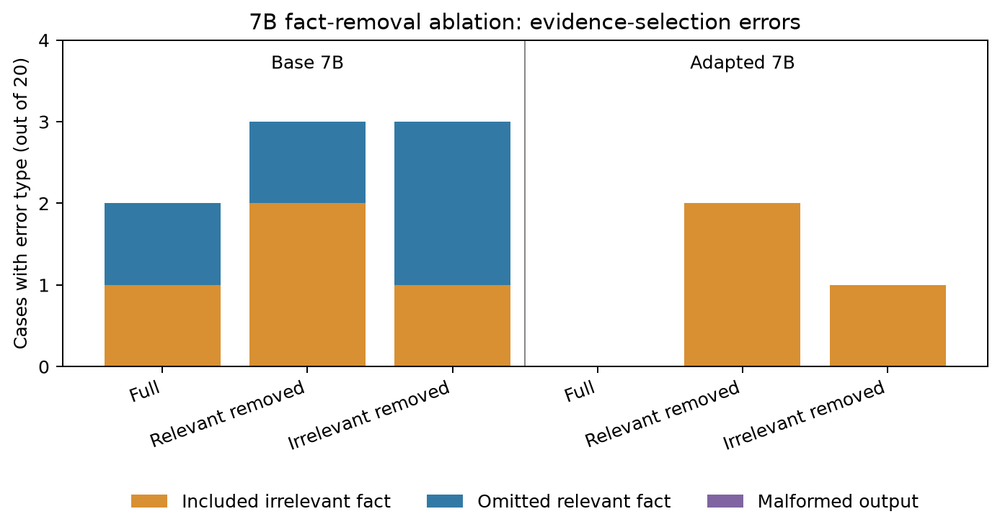

# Auditoria dos erros da ablação de fatos (7B)

Esta análise reprocessa as 120 respostas preservadas do
[`kaggle-7b-raw-responses.json`](../reports/2026-10-04/fact-ablation/kaggle-7b-raw-responses.json)
contra os 60 casos do conjunto congelado. Há 20 problemas-base, cada um em três
contextos; os dois braços (base e adaptado em 320 passos) respondem aos mesmos
casos. O código usa a função de pontuação já empregada no projeto, valida o
SHA-256 do conjunto e exige um registro por caso em cada braço.

| Braço e contexto | Seleção exata | Casos com inclusão indevida | Casos com omissão | JSON inválido |
| --- | ---: | ---: | ---: | ---: |
| 7B base: completo | 18/20 | 1 | 1 | 0 |
| 7B base: sem atualização relevante | 17/20 | 2 | 1 | 0 |
| 7B base: sem fato irrelevante | 17/20 | 1 | 2 | 0 |
| 7B adaptado: completo | 20/20 | 0 | 0 | 0 |
| 7B adaptado: sem atualização relevante | 18/20 | 2 | 0 | 0 |
| 7B adaptado: sem fato irrelevante | 19/20 | 1 | 0 | 0 |



Nos três erros do 7B adaptado, o modelo incluiu **F10**, uma atualização do
outro recipiente. Eles ocorreram nas bases 0011 e 0014 após retirar a primeira
atualização relevante e na base 0000 após retirar um fato irrelevante. Não houve
omissão de fatos relevantes nem resposta fora do formato no braço adaptado.
Isso é mais específico que dizer que ele "não identificou o contexto": o erro
residual observado é incluir uma atualização alheia no fim da lista. Não prova
que a posição F10 seja a causa; seria necessário variar a ordem dos fatos em
um novo teste congelado.

A comparação pareada evita interpretar os 60 contextos como independentes. No
7B base, retirar uma atualização relevante fez três bases passarem de acerto
para erro e duas de erro para acerto; 15 permaneceram corretas. Retirar um fato
irrelevante conservou 17 acertos, manteve dois erros e criou um erro. No 7B
adaptado, o contexto completo foi correto nas 20 bases; a remoção relevante
criou dois erros e a irrelevante criou um. O ganho líquido do adaptado sobre o
base é de 2, 1 e 2 acertos nos três contextos, respectivamente. Essas diferenças
são descritivas e pequenas; não constituem estimativa estável do efeito de
treinamento a partir de uma única semente.

A ablação mede sensibilidade da **saída de seleção** a fatos visíveis. Ela não
observa atenção, ativações ou um mecanismo interno de pensamento. A resposta
aritmética posterior vem do executor determinístico, então acerto final não
significa que a LLM tenha calculado. O conjunto é sintético, em inglês, e usa
apenas 20 bases. O achado pode entrar no artigo como análise de erros com essas
limitações explícitas.

Para reproduzir a auditoria sem inferência nem GPU:

```powershell
poetry run python scripts/analyze_fact_ablation.py `
  --dataset reports/2026-10-04/fact-ablation/dataset.json `
  --raw reports/2026-10-04/fact-ablation/kaggle-7b-raw-responses.json `
  --output reports/<nova-data>/fact-ablation-audit
```

O relatório completo por caso está em
[`audit.json`](../reports/2026-10-07/fact-ablation-audit-v2/audit.json).
O primeiro render da figura foi preservado em `fact-ablation-audit/`; o render
revisado, com legenda sem sobreposição, está em `fact-ablation-audit-v2/`.
