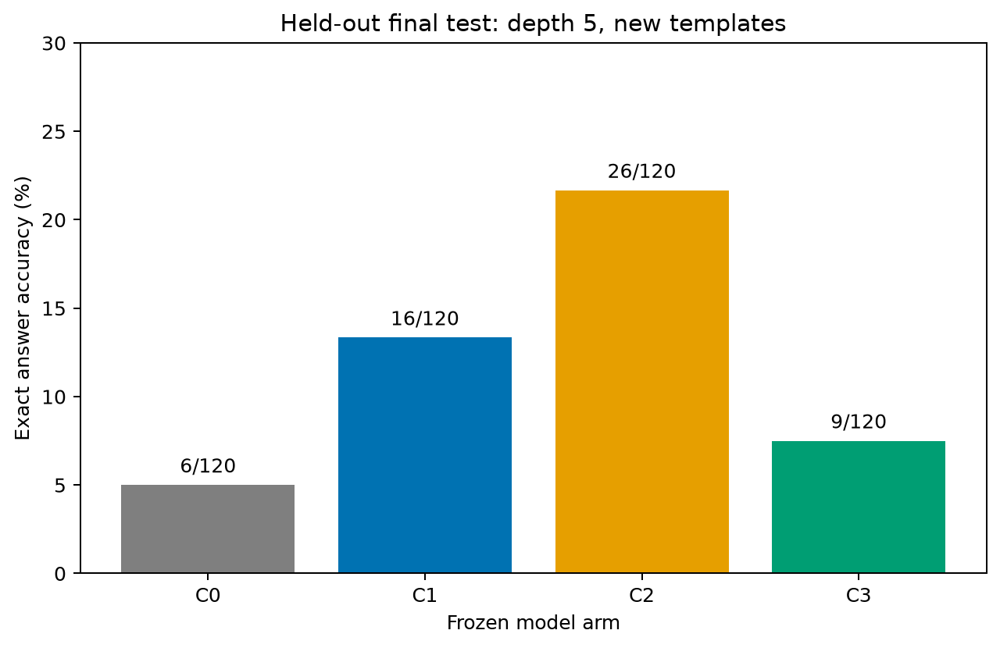

# Fechamento da rodada local — teste final congelado

O protocolo foi [registrado antes da abertura do teste](frozen-test-protocol-2026-09-30.md).
Foram avaliados o Qwen2.5-1.5B-Instruct original (C0) e três adaptadores
LoRA treinados localmente (C1–C3). Os nove treinos das sementes 42, 43 e 44
e seus resultados de **validação** estão [documentados separadamente](local-controls-2026-09-30.md).
No **teste final**, foi usado somente o checkpoint previamente fixado da
semente 42 de cada braço ajustado; C0 não tem semente de treinamento.

O teste contém **120 casos em inglês**: dez problemas-base de cada tarefa
(aritmética, dedução e acompanhamento), com quatro versões pareadas por
problema: contexto limpo, distrator não relacionado, distrator numérico e
distrator semanticamente similar. O treino usou profundidades 2–3, a
validação profundidade 4 e o teste profundidade 5 com novos templates.
As mudanças de profundidade e template são conjuntas.

## Resultado primário: resposta exata

O denominador inclui toda resposta ausente, malformada ou incorreta. A
análise `answer_only` verifica a resposta de um JSON completo ou de um
único bloco Markdown com JSON; não exige que a lista de evidências esteja
correta. Isso evita confundir acerto da resposta com o contrato de evidência.

| Braço | Treino | Acertos / 120 | Aritmética / 40 | Dedução / 40 | Acompanhamento / 40 |
|---|---|---:|---:|---:|---:|
| C0 | Sem ajuste | 6 (5,0%) | 0 | 1 | 5 |
| C1 | Contexto limpo; loss na resposta | 16 (13,3%) | 0 | 10 | 6 |
| C2 | Contexto similar; loss na resposta | **26 (21,7%)** | 0 | **19** | 7 |
| C3 | Contexto similar; loss na resposta e nas evidências | 9 (7,5%) | 0 | 2 | 7 |

| Braço | Limpo / 30 | Não relacionado / 30 | Numérico / 30 | Similar / 30 |
|---|---:|---:|---:|---:|
| C0 | 4 | 0 | 0 | 2 |
| C1 | 12 | 1 | 0 | 3 |
| C2 | 12 | 5 | 4 | 5 |
| C3 | 7 | 2 | 0 | 0 |

Em relação a C0, C1 ganhou 12 casos antes errados e perdeu 2 antes certos;
C2 ganhou 21 e perdeu 1; C3 ganhou 6 e perdeu 3. Essas transições são
pareadas pelos mesmos IDs. O ganho líquido de C2 foi 20/120, mas sua
acurácia com distratores continua baixa: 14/90 nas três condições ruidosas.
Nenhum braço acertou um caso de aritmética no teste.

## Formato, evidências e custo de inferência

| Braço | JSON estrito aceito / 120 | Conteúdo legível / 120 | Evidências exatas / 120 | Tokens gerados | Geração (s) |
|---|---:|---:|---:|---:|---:|
| C0 | 0 | 104 | 6 | 3.542 | 143,4 |
| C1 | 113 | 113 | 12 | 3.275 | 173,2 |
| C2 | 110 | 110 | 12 | 3.905 | 199,6 |
| C3 | 107 | 107 | 21 | 4.717 | 242,0 |

O valor de C0 para JSON estrito é zero porque suas saídas vieram em blocos
Markdown; o parser de conteúdo recupera os JSONs completos desses blocos.
Em C2, há 26 respostas exatas na análise independente, mas 25 no relatório
que também valida as evidências. A resposta correta adicional continha
evidências inválidas. Os 21/120 de evidências exatas em C3 são superiores
aos 12/120 de C2, embora C3 acerte menos respostas. Os tempos medem apenas
geração, não carga do modelo, preparação de dados ou avaliação; a comparação
de tempo não foi controlada para carga concorrente do computador.

## Interpretação e limites

O ajuste C2 foi o melhor nesta avaliação reservada e mostrou ganho em
dedução com distratores. A transferência para acompanhamento foi pequena
(7/40 contra 5/40 em C0), e a aritmética permaneceu sem acertos. Portanto,
o resultado sustenta uma melhora **comportamental e limitada** em seleção
de informação relevante; não demonstra um mecanismo interno geral de
raciocínio nem melhora em todas as tarefas.

C2 e C3 tiveram o mesmo número de exemplos e passos, mas **não** o mesmo
orçamento de tokens supervisionados: 570 versus 1.906, além de diferença
na supervisão do encerramento. Assim, a piora de C3 não pode ser atribuída
isoladamente a solicitar evidências. O conjunto é sintético, pequeno e em
inglês; a tarefa-fonte foi escolhida depois de diagnósticos exploratórios.
As três sementes da validação não foram repetidas no teste final, portanto
não há intervalo confiável aqui para a variabilidade de treinamento. O
contraste de tamanhos 0,5B/1,5B pertence a um piloto anterior com outro
benchmark e não deve ser misturado com este teste.

## Reprodutibilidade

O [diretório público dos resultados](../reports/2026-09-30/frozen-test/)
contém o conjunto de teste, manifestos com hashes e versão do modelo,
respostas brutas, previsões, relatórios estritos e de conteúdo, resumos de
tempo/tokens, gráficos e transições pareadas por braço. Os pesos e estados
do otimizador permanecem no diretório `data/` local, ignorado pelo Git.
O teste foi executado pela CLI `scripts/run_frozen_test.py` com o dataset
v2.1 fixado no protocolo, em BF16, geração gulosa, limite de 128 novos
tokens e seed de geração 42. A execução terminou com código 0 e o marcador
`completed-final.json`.

A rodada local acordada está encerrada. Uma comparação adicional com outros
parâmetros ou com um modelo maior pode ser feita depois como experimento
novo, com protocolo e resultados separados; não muda este teste reservado.
