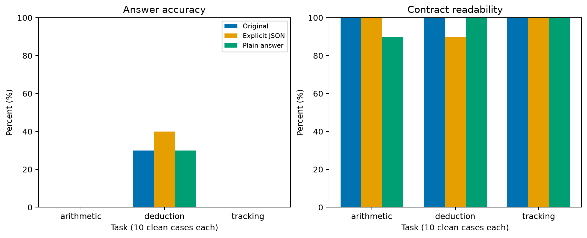

# Diagnóstico local de formato — 29/09/2026

## Resultado

Foram concluídas 60 novas gerações nos mesmos 30 problemas limpos da validação v2.1. O modelo original 1,5B, revisão, precisão BF16, fatos, perguntas, ordem, seed e limites permaneceram iguais. O baseline foi reutilizado com verificação dos hashes de prompt.

| Tarefa (10 casos cada) | Original: acertos / legíveis | JSON explícito | Resposta simples |
|---|---|---|---|
| Aritmética | 0 / 10 | 0 / 10 | 0 / 9 |
| Dedução | 3 / 10 | 4 / 9 | 3 / 10 |
| Acompanhamento | 0 / 10 | 0 / 10 | 0 / 10 |

A legibilidade aqui é a aceitação pelo contrato de conteúdo de cada braço, não a conformidade estrita com JSON puro. Rejeições permanecem no denominador. No JSON explícito usamos o mesmo parser de conteúdo anterior; na resposta simples aceitamos apenas um inteiro ou código P/B completo, sem extrair respostas de explicações.

O formato não resolveu o efeito de piso: aritmética e acompanhamento continuaram sem acertos. O ganho agregado de um acerto em dedução no JSON explícito não sustenta uma escolha de formato por superioridade, dado o tamanho e caráter exploratório da amostra. Não foi escolhido o melhor braço por exemplo, nem alterado o prompt padrão do projeto.

Na resposta simples de aritmética `000008:clean`, o modelo respondeu `51`, contra gabarito `47`. A saída legível também pode estar incorreta. A ambiguidade da instrução original não deve ser tratada como explicação suficiente para todos os erros.

## Controles e limitações

O [protocolo](format-diagnostic-protocol.md) foi commitado antes de executar. A instrução explícita modifica a redação; o braço simples também retira a exigência de evidências. Esses contrastes não isolam uma única palavra nem permitem inferência sobre mecanismos internos. Não houve treinamento, consulta ao teste final ou execução na nuvem.

Execução `9c56f3a66c3b5d6f`, código `d4cc5f3`, baseline `145ba1dd1550430d`. Os arquivos preservam datas UTC, tokens, memória, respostas brutas e hashes de entradas/código. O script identifica cada braço e rejeita checkpoints que não correspondem ao prompt atual.

```powershell
poetry run python scripts/diagnose_format.py reports/2026-09-28/145ba1dd1550430d data/format-diagnostic/2026-09-29
poetry run python scripts/plot_format_diagnostic.py reports/2026-09-29/format-diagnostic-9c56f3a66c3b5d6f/report.json reports/2026-09-29/format-diagnostic-9c56f3a66c3b5d6f/format-accuracy.png
```

O gráfico não é sobrescrito quando já existe. Os [artefatos públicos](../reports/2026-09-29/format-diagnostic-9c56f3a66c3b5d6f/) são cópias dos resultados locais completos, sem pesos.



## Próximo passo

Diagnosticar profundidade mantendo linguagem controlada antes de aumentar treinamento. Não declarar a fase local terminada: ainda faltam o executor científico, os controles C1/C2/C3, repetições, transferência e incerteza, conforme a [lista de conclusão local](local-completion-checklist.md). O teste funcional de seis passos não substitui essas etapas.
