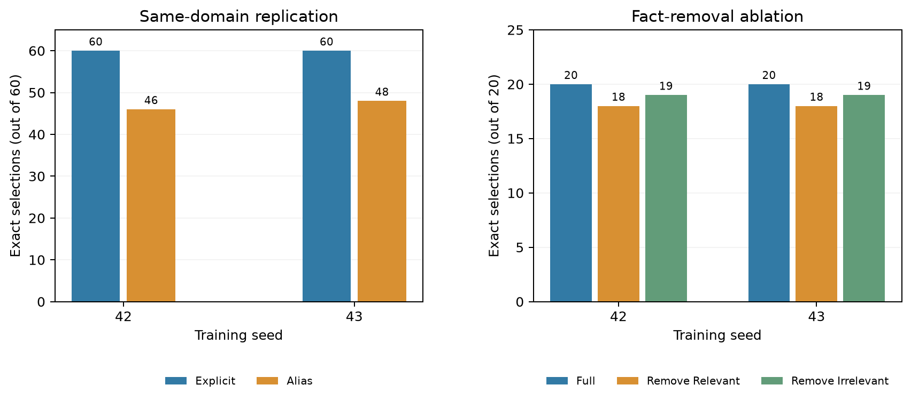

# Repetição do treino 7B com semente 43

Em 7 de outubro de 2026, a [versão 2 do notebook no Kaggle](https://www.kaggle.com/code/matheusdsousaribeiro/foco-llm-qwen-7b-seed-43-replication?scriptVersionId=356099017)
concluiu em 53 minutos e 2 segundos numa sessão T4 x2. O treino usou
Qwen2.5-7B-Instruct, QLoRA rank 4, 80 exemplos aritméticos de seleção de
evidências, learning rate `1e-4`, 320 passos e semente de seleção 42. A única
mudança planejada em relação ao adaptador anterior foi a semente de treinamento:
43 em lugar de 42. O manifesto do treino e os resumos estão no
[pacote de evidências](../reports/2026-10-07/kaggle-7b-seed43-evidence-v4.json).
O importador conferiu o SHA-256 do conjunto de treino, dos dois testes congelados,
do adaptador de 320 passos e do manifesto de treino referenciado pelas avaliações.
Ele também recomputou as contagens de seleção exata e acerto a partir das 180
pontuações individuais, que contêm as respostas brutas.
O pacote publicado omite apenas o caminho interno do adaptador e um hash de
diagnóstico do manifesto para evitar falsos alertas na varredura de segredos;
os manifestos originais íntegros permanecem no output da versão 2 do Kaggle.

| Avaliação | Semente 42 | Semente 43 | Denominador |
| --- | ---: | ---: | ---: |
| Replicação: referência explícita | 60 | 60 | 60 bases |
| Replicação: referência por apelido | 46 | 48 | 60 bases |
| Ablação: contexto completo | 20 | 20 | 20 bases |
| Ablação: atualização relevante removida | 18 | 18 | 20 bases |
| Ablação: fato irrelevante removido | 19 | 19 | 20 bases |



Na condição com apelido, a segunda semente manteve desempenho acima do 7B
sem adaptação registrado anteriormente (36/60), mas a diferença de 46/60 para
48/60 entre adaptadores é pequena e descritiva. Os 12 erros da semente 43 nessa
condição foram omissões de fatos necessários; não houve inclusão indevida. Na
ablação, as duas sementes produziram os mesmos totais e os mesmos três erros:
inclusão de F10 nas bases 0011 e 0014 após remover a atualização relevante, e
na base 0000 após remover o fato irrelevante. Isso apoia a estabilidade desses
resultados **neste pequeno conjunto**, sem provar insensibilidade geral à
semente. A amostra de duas sementes não permite estimar uma distribuição de
desempenho confiável.

Esta repetição foi decidida depois da inspeção dos testes. É uma **análise
pós-hoc de robustez**, não uma segunda confirmação cega. As 60 bases da
replicação geram duas variantes pareadas, e as 20 da ablação geram três; não
tratamos 120 ou 60 variantes como observações independentes. A saída avaliada é
a lista de IDs de evidências. A resposta numérica foi calculada por um executor
determinístico, de modo que o acerto final não demonstra aritmética interna da
LLM. O benchmark sintético não estabelece desempenho em textos naturais ou
outras tarefas.

O notebook concluído foi a **versão 2**, que embutiu cópias dos três scripts e
dos conjuntos congelados; os SHA-256 desses scripts correspondem aos arquivos
do repositório em 7/10. O notebook agora versionado em
[`notebooks/kaggle_qwen_7b_seed43.ipynb`](../notebooks/kaggle_qwen_7b_seed43.ipynb)
foi simplificado para clonar o commit fixado `d403c12f6f25` e não é o arquivo
exato executado na versão 2. Por isso, o registro primário é o output imutável
da versão 2, com seus manifestos e respostas; a versão atual do notebook ainda
não foi reexecutada.

Para reconstruir o pacote e a figura a partir do arquivo `results.zip` baixado
do output daquela versão, em novos caminhos de saída:

```powershell
poetry run python scripts/import_kaggle_seed_replication.py `
  --archive <caminho-para-results.zip> `
  --output reports/<nova-data>/kaggle-7b-seed43-evidence.json `
  --figure reports/<nova-data>/kaggle-7b-seed-stability.png
```

As contagens da semente 42 no gráfico vêm dos relatórios
[`blind-replication-protocol-2026-10-04.md`](blind-replication-protocol-2026-10-04.md)
e [`fact-ablation-2026-10-04.md`](fact-ablation-2026-10-04.md); as pontuações
por caso daquela semente não fazem parte deste pacote. O ZIP original fica no
computador local e também pode ser baixado novamente no Kaggle. O pacote
compacto preserva todos os 180 escores e respostas, mas não duplica os pesos
do adaptador de aproximadamente 5 MB por checkpoint.
