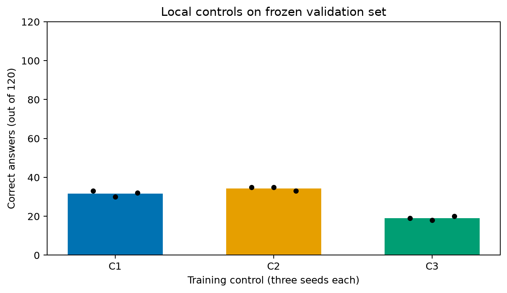

# Controles locais concluídos — 30/09/2026

Foram executados **nove treinamentos LoRA** no Qwen2.5-1.5B-Instruct:
três braços × sementes 42, 43 e 44. Cada execução recebeu 32 problemas-base
de dedução do treino v2.1, 64 atualizações, batch 1 e os mesmos hiperparâmetros.
A seleção dos problemas-base e sua ordem foram iguais em todos os braços.
Cada adaptador foi avaliado nos mesmos 120 casos de validação: 30 bases ×
quatro condições, com três tarefas. O teste final não foi aberto.

| Braço | Treino / supervisão | Acertos por semente, de 120 | Média |
|---|---|---|---:|
| C0 | Modelo original, sem treino | 6 | 6,0 |
| C1 | Contexto limpo, resposta | 33, 30, 32 | 31,7 |
| C2 | Contexto similar, resposta | 35, 35, 33 | 34,3 |
| C3 | Contexto similar, resposta + evidências | 19, 18, 20 | 19,0 |

Os valores por tarefa são contagens de 40 casos por semente:

| Tarefa | C0 | C1: seeds 42/43/44 | C2: seeds 42/43/44 | C3: seeds 42/43/44 |
|---|---:|---:|---:|---:|
| Aritmética | 0 | 0 / 0 / 0 | 0 / 0 / 0 | 0 / 0 / 0 |
| Dedução (fonte) | 6 | 28 / 27 / 30 | 30 / 30 / 29 | 17 / 17 / 18 |
| Acompanhamento (alvo) | 0 | 5 / 3 / 2 | 5 / 5 / 4 | 2 / 1 / 2 |

**Leitura:** todos os ajustes melhoraram a tarefa-fonte nesta validação.
Supervisionar também evidências (C3) ficou atrás de supervisionar a resposta
com os mesmos exemplos ruidosos (C2) nas três sementes. O contraste C2−C1
em dedução foi +3,3 pontos percentuais, com intervalo exploratório de
−1,7 a +8,3 p.p. O contraste C3−C2 foi −30,8 p.p., intervalo de
−46,7 a −16,7 p.p. Ambos foram calculados reamostrando os dez problemas-base
de dedução e mantendo suas quatro variantes juntas. São intervalos
**condicionais às três sementes executadas**, não incorporam a incerteza de
amostragem das sementes nem dão suporte a uma conclusão populacional ampla.

Na tarefa-alvo acompanhamento, C2 acertou 4–5/40, contra 0/40 no modelo
original; aritmética permaneceu em 0/40. Há um sinal de transferência
limitada para acompanhamento, sem prova de mecanismo geral de seleção de
informações e sem competência em aritmética. O estudo não deve ser resumido
como melhora universal de raciocínio.

## Controles e custos medidos

- [Protocolo congelado antes do lote](local-controls-protocol.md).
- C1/C2 supervisionaram 570 tokens em 64 passos; C3 supervisionou 1.906.
  A diferença de orçamento de tokens e do encerramento supervisionado impede
  atribuir a piora de C3 *isoladamente* às evidências.
- As taxas de JSON estrito foram 118–120/120 em cada braço; a diferença de
  acurácia entre C2 e C3 não vem apenas de respostas ilegíveis.
- As saídas aceitas em cada braço foram avaliadas com o mesmo contrato de
  conteúdo, mesmo dataset e seed de geração 42. Rejeições permanecem no
  denominador. O controle original tinha 6/120 acertos sob esse contrato.
- Os tempos internos de treino variaram entre execuções, inclusive um valor
  atípico de 543 s em C3/seed 44. São apenas tempos dos passos, não incluem
  carga, checkpoints e avaliação; não servem para afirmar vantagem de custo
  de um braço sem medir o tempo total e a carga concorrente da máquina.

[Relatório agregado e figura](../reports/2026-09-30/local-controls-matrix/) ·
[Respostas brutas, históricos, manifestos e decisões por braço/semente](../reports/2026-09-30/local-controls-matrix/arms/).
Pesos de adaptador e estados de otimizador permanecem somente em `data/` local.

## Limitações e pendências antes do Kaggle

O benchmark é sintético e em inglês. Treino e validação diferem em template
e profundidade simultaneamente. A escolha da tarefa-fonte ocorreu após os
diagnósticos locais; os resultados são exploratórios. O contraste C1/C2
inclui a mudança de contexto de treino; C2/C3 inclui a mudança na máscara
de loss e no número de tokens supervisionados. A ordem dos dados foi
congelada, mas três sementes ainda são poucas. Os resultados do teste final
e uma checagem manual estratificada das novas respostas ainda são pendentes.

Antes de declarar a fase local fechada: auditar manualmente exemplos
representativos e casos de transição, revisar integridade/publicação, fixar
o protocolo do teste final e produzir as tabelas finais do artigo. Um
controle adicional de orçamento de tokens, se houver tempo, fortaleceria
a atribuição do contraste C2/C3; deve entrar como análise posterior,
identificada separadamente do protocolo original.
