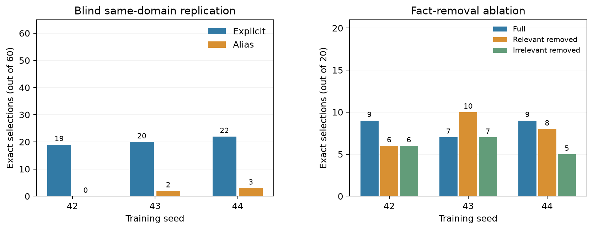

# Sensibilidade à semente no seletor local de 1,5B

Em 7 de outubro de 2026, repetimos o treino de seleção de evidências do
Qwen2.5-1.5B-Instruct com sementes 43 e 44. A execução anterior usava 42.
Os três treinos partiram da mesma revisão do modelo, dos mesmos **80 exemplos
na mesma ordem**, do mesmo prompt e da mesma configuração LoRA: rank 4,
learning rate `1e-4`, batch 1 e 320 atualizações. A única diferença de
configuração foi a semente de inicialização (`seed`); `selection_seed` ficou
em 42. Os manifestos foram comparados campo a campo, exceto por `seed`.

Os dois novos adaptadores concluíram 320 passos. Em ambos, o hash dos pesos
base permaneceu inalterado, os pesos do adaptador mudaram e a recarga do
checkpoint reproduziu os logits de referência (diferença máxima zero). A
perda de treino final foi aproximadamente `0,000145` na semente 43 e
`0,000104` na 44; não a usamos para escolher um braço.

Todos os três adaptadores foram avaliados com geração gulosa nos **mesmos
conjuntos já congelados**: a replicação aritmética com 60 bases em versões
explícita e com apelido, e a ablação de 20 bases em três contextos.

| Semente | Explícito (60) | Apelido (60) | Ablação: completo (20) | Sem relevante (20) | Sem irrelevante (20) |
| --- | ---: | ---: | ---: | ---: | ---: |
| 42 | 19 | 0 | 9 | 6 | 6 |
| 43 | 20 | 2 | 7 | 10 | 7 |
| 44 | 22 | 3 | 9 | 8 | 5 |



No teste de apelidos, **nenhuma** semente atingiu sequer 4/60. A diferença de
0/60 a 3/60 é pequena em termos absolutos, embora mostre que o valor exato
depende da inicialização. Na ablação, a ordem das condições mudou entre
sementes: para a 43, retirar a atualização relevante aumentou os acertos de
7 para 10; para a 42, reduziu de 9 para 6. Essa variação impede generalizar
uma direção única do efeito de remoção para o modelo local. O contexto sem
fato irrelevante variou de 5 a 7 acertos em 20.

Esta é uma **análise pós-hoc de robustez**, não um novo teste cego: os
conjuntos já tinham sido inspecionados quando definimos repetir o treino.
As 60 bases da replicação são unidades pareadas; as 120 entradas não são
120 observações independentes. Três sementes oferecem uma primeira checagem
de variabilidade, não uma distribuição confiável de desempenho. Os números
do 7B continuam provenientes de **uma** semente de treinamento; esta análise
local não resolve aquela limitação.

O [pacote auditável](../reports/2026-10-07/local-seed-replication-v2.json)
reúne configurações e manifestos de treino, resumos, pontuações individuais,
respostas brutas e manifestos das duas avaliações para as três sementes.
Os arquivos de checkpoint completos ficam em `data/seed-replication/2026-10-07/`
e no diretório do treino original, ambos ignorados pelo Git. O pacote `v1`
foi preservado como render intermediário; o `v2` acrescenta os manifestos de
treino e é o registro indicado para revisão. O gráfico é reproduzível por:

```powershell
poetry run python scripts/plot_local_seed_stability.py `
  --bundle reports/2026-10-07/local-seed-replication-v2.json `
  --output reports/<nova-data>/local-seed-stability.png
```

Para o artigo, a conclusão prudente é que a adaptação local teve resultado
fraco nos apelidos em todas as sementes testadas e que a sensibilidade à
remoção de fatos não foi estável no subconjunto de 20 bases. A melhora mais
forte do 7B permanece uma observação separada e ainda precisa de repetição
própria para estimar a variabilidade de treinamento nesse porte.
