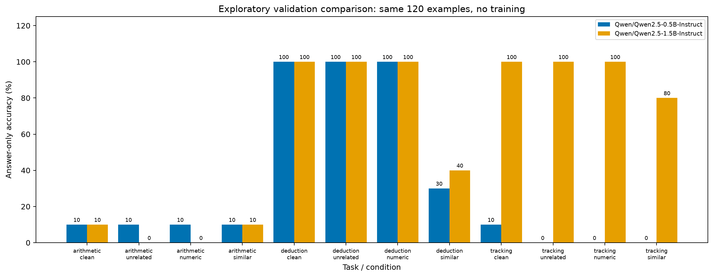

# Comparação local em BF16 — 2026-09-27

O modelo de 1,5B acertou 74/120 respostas (61,7%), contra 38/120 (31,7%) do modelo de 0,5B. A diferença foi principalmente em acompanhamento de objetos. Ambos tiveram apenas 1/10 acertos em aritmética limpa. São resultados de checkpoints originais, não ganhos de treinamento.

## Resultados

Cada célula abaixo contém acertos em dez exemplos. O acerto é medido independentemente da validade dos identificadores de evidência.

| Tarefa | Condição | 0,5B | 1,5B |
|---|---|---:|---:|
| Aritmética | Limpa | 1 | 1 |
| Aritmética | Não relacionado | 1 | 0 |
| Aritmética | Numérico | 1 | 0 |
| Aritmética | Semelhante | 1 | 1 |
| Dedução | Limpa | 10 | 10 |
| Dedução | Não relacionado | 10 | 10 |
| Dedução | Numérico | 10 | 10 |
| Dedução | Semelhante | 3 | 4 |
| Acompanhamento | Limpa | 1 | 10 |
| Acompanhamento | Não relacionado | 0 | 10 |
| Acompanhamento | Numérico | 0 | 10 |
| Acompanhamento | Semelhante | 0 | 8 |



As transições pareadas mostram que, em dedução com distratores semelhantes, sete dos dez acertos limpos viraram erros no modelo de 0,5B e seis no de 1,5B, sem transições inversas. Em acompanhamento, o modelo de 1,5B perdeu dois dos dez acertos na condição semelhante. Em aritmética semelhante do modelo de 1,5B, a média permaneceu 1/10, mas houve uma transição acerto→erro e outra erro→acerto; médias iguais não significam respostas estáveis.

O limiar exploratório de 8/10 acertos limpos foi alcançado pelo modelo de 0,5B somente em dedução e pelo de 1,5B em dedução e acompanhamento. Nenhum atingiu o limiar em aritmética. Recomenda-se o modelo de 1,5B como candidato ao teste funcional de ajuste, após revisão dos dados. A viabilidade da inferência não garante memória suficiente para treinamento com otimizador e ativações.

| Formato e evidências — denominador 120 | 0,5B | 1,5B |
|---|---:|---:|
| JSON puro aceito | 0 | 0 |
| Objeto legível permitindo bloco Markdown | 120 | 120 |
| Objeto com identificadores válidos | 107 | 119 |
| Resposta correta exigindo identificadores válidos | 27 | 73 |
| Seleção exata das evidências | 34 | 71 |

Todas as saídas usaram blocos Markdown. A pontuação estrita zero é uma falha de contrato de formato e fica separada do acerto da resposta. Como exemplo qualitativo, em `arithmetic-000008:clean`, o modelo de 1,5B selecionou F1/F2/F3, mas respondeu 8 em vez de 48. Em `tracking-000008:clean`, respondeu corretamente B110. Esses exemplos ilustram saídas, sem provar um mecanismo interno.

## Recursos e estabilidade

| Medida | 0,5B | 1,5B |
|---|---:|---:|
| Tempo acumulado de geração (s) | 505,14 | 460,05 |
| Tokens de saída | 5.129 | 3.904 |
| Pico alocado pelo PyTorch (bytes) | 1.039.616.512 | 3.139.686.400 |
| Pico reservado pelo PyTorch (bytes) | 1.080.033.280 | 3.347.054.592 |
| Encerramento por EOS | 120 | 120 |
| Limite de tokens / tempo atingido | 0 / 0 | 0 / 0 |

Ambas as execuções completas passaram pela proteção de scores sem falha numérica. O modelo maior gerou menos tokens; seu menor tempo total não demonstra maior velocidade por token. Tempos excluem download, carregamento, tokenização e gravação; a proteção numérica faz parte do custo de geração. Memória mede somente o PyTorch, não todo o consumo da GPU. São medições únicas, em sequência, sem repetição de desempenho operacional.

O tempo do baseline antigo em FP16 não é diretamente comparável: além da precisão, o caminho de geração passou a incluir verificações numéricas. Não houve quantização, treinamento ou medição de custo em nuvem.

## Escopo e controles

Comparação exploratória de Qwen2.5-0.5B-Instruct e Qwen2.5-1.5B-Instruct, sem ajuste de pesos. Ambos receberam os mesmos 120 exemplos de validação: dez problemas-base por tarefa e quatro condições por problema. As variantes são dependentes; não tratar as 120 respostas como 120 problemas independentes.

Os dois modelos usaram BF16, RTX 3060 Laptop de 6 GB, atenção eager, geração gulosa, seed 42, lote unitário, até 128 tokens novos, 1.024 tokens de entrada e limite cooperativo de 60 segundos por exemplo. O código de inferência corresponde a `24bc5e0`; os manifestos registram o hash dos fontes e as versões do runtime. O [protocolo](model-comparison-protocol.md) registra a emenda de precisão e o critério de triagem definidos antes destes resultados.

| Modelo | Revisão | Execução |
|---|---|---|
| 0,5B | `7ae557604adf67be50417f59c2c2f167def9a775` | `d3382a884de2c421` |
| 1,5B | `989aa7980e4cf806f80c7fef2b1adb7bc71aa306` | `6836fbda70e99de1` |

A tentativa anterior de 1,5B em FP16 foi uma [falha numérica documentada](numerical-failure-2026-09-27.md) e não participa desta comparação. O baseline anterior de 0,5B em FP16 também fica separado. Os resultados históricos permanecem preservados.

## Leitura das métricas

O protocolo `content-envelope-v2` separa três leituras das mesmas respostas brutas: contrato estrito de JSON puro; conteúdo com identificadores de evidência válidos, permitindo um único bloco Markdown completo; e acerto da resposta independentemente da validade desses identificadores. Não há reparo de valores, extração de respostas de prosa ou mudança de prompt durante a comparação.

Todas as taxas usam o denominador completo, incluindo rejeições. A seleção exata de evidências vem da leitura de conteúdo. Os campos de evidência da leitura `answer_only` não são interpretáveis, pois nessa leitura as listas são vazias por construção. Indicar fatos corretos não demonstra que o modelo os utilizou internamente.

## Reprodução dos artefatos

Com os checkpoints locais disponíveis, exportar e reavaliar cada execução:

```powershell
$datasetPath = 'data/processed/2026-09-27/969659029e986d86/dataset.json'
$runIds = @('d3382a884de2c421', '6836fbda70e99de1') # pragma: allowlist secret -- public run IDs
foreach ($runId in $runIds) {
    poetry run python scripts/export_baseline.py $datasetPath "data/inference/2026-09-27/$runId" "reports/2026-09-27/$runId"
    if ($LASTEXITCODE -ne 0) { throw 'Baseline export failed' }
    poetry run python scripts/evaluate_content.py "reports/2026-09-27/$runId" "reports/2026-09-27/$runId-content-v2"
    if ($LASTEXITCODE -ne 0) { throw 'Content evaluation failed' }
}
poetry run python scripts/compare_baselines.py reports/2026-09-27/d3382a884de2c421 reports/2026-09-27/6836fbda70e99de1 reports/2026-09-27/model-comparison-bf16
```

Os relatórios públicos incluem os enunciados de validação e as respostas brutas; a reavaliação e a comparação dispensam GPU. A exportação confere a pontuação estrita original. A comparação confere hashes de entrada, exemplos, configuração, runtime e protocolo antes de publicar. Os resultados não são sobrescritos com conteúdo diferente.

- [Artefatos originais de 0,5B](../reports/2026-09-27/d3382a884de2c421/) e [análise de conteúdo](../reports/2026-09-27/d3382a884de2c421-content-v2/).
- [Artefatos originais de 1,5B](../reports/2026-09-27/6836fbda70e99de1/) e [análise de conteúdo](../reports/2026-09-27/6836fbda70e99de1-content-v2/).
- [Comparação legível por máquina](../reports/2026-09-27/model-comparison-bf16/comparison.json).
- Dispersão limpa/com distratores: [0,5B](../reports/2026-09-27/d3382a884de2c421-content-v2/answer-only-paired-accuracy.png) e [1,5B](../reports/2026-09-27/6836fbda70e99de1-content-v2/answer-only-paired-accuracy.png). Cada ponto representa tarefa/condição; pontos coincidentes podem se sobrepor. As transições detalhadas estão nos JSONs.

## Limitações e próxima decisão

Este piloto tem poucos problemas, dificuldade fixa e templates compartilhados entre splits. A [auditoria qualitativa](model-comparison-protocol.md#auditoria-qualitativa-do-piloto-existente) identificou nomes artificiais, pistas lexicais e limitações de ordenação temporal. Não é uma demonstração de generalização entre tarefas nem permite atribuir causalmente diferenças ao número de parâmetros.

O próximo passo é revisar os dados e congelar o protocolo antes do teste funcional de treinamento. O [plano local e de nuvem](training-and-cloud-plan.md) separa os controles de supervisão, três sementes por configuração e reprodução em outro hardware. Não houve treinamento, execução em nuvem, uso do teste final para inferência ou alteração do artigo nesta comparação.
