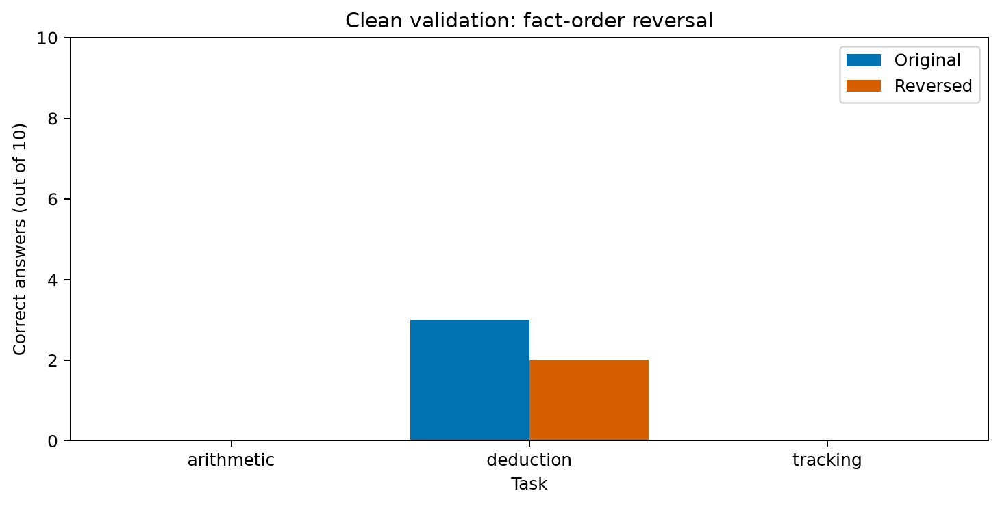

# Diagnóstico de ordem dos fatos — 2026-09-28

## Resultado

Foram geradas 30 respostas novas para os mesmos problemas limpos da validação v2.1, invertendo apenas a apresentação das frases e preservando os IDs. O modelo original foi usado sem adaptador. Nenhum treinamento foi realizado nesta etapa.

| Tarefa | Ordem original | Ordem invertida | Erro → acerto | Acerto → erro |
|---|---:|---:|---:|---:|
| Aritmética | 0/10 | 0/10 | 0 | 0 |
| Dedução | 3/10 | 2/10 | 2 | 3 |
| Acompanhamento | 0/10 | 0/10 | 0 | 0 |
| Total | 3/30 | 2/30 | 2 | 3 |

A reversão alterou a correção de cinco respostas de dedução. Os três acertos originais deixaram de ser acertos; dois outros casos passaram a ser corretos. A diferença líquida de um acerto esconde essa instabilidade. Não há evidência de que essa inversão melhore o desempenho global.

Em aritmética e acompanhamento, ambos os braços ficaram no piso. Isso não demonstra invariância do raciocínio à ordem nem explica a origem dos erros. Todas as tarefas continuam abaixo do limiar exploratório de competência limpa de 8/10.

## Pares que mudaram

Todos os IDs abaixo pertencem à dedução, condição limpa:

| Sufixo do problema-base | Original | Invertida |
|---|---|---|
| 000008 | Correta | Incorreta |
| 000028 | Correta | Incorreta |
| 000048 | Correta | Incorreta |
| 000078 | Incorreta | Correta |
| 000088 | Incorreta | Correta |

Não selecionamos a melhor ordem para cada item. Essa seleção usaria o resultado para construir uma pontuação artificialmente favorável.

## Método e controles

O [protocolo](order-diagnostic-protocol.md) foi registrado antes da geração. Usamos todos os dez problemas limpos por tarefa, sem selecionar pelos acertos. Os gabaritos foram recalculados pelo solucionador independente antes da inferência, tanto na ordem original quanto invertida. O código rejeita problemas fora da validação limpa ou gabaritos inconsistentes.

Pergunta, frases, IDs de fatos, gabarito, prompt, checkpoint do modelo, precisão BF16, seed e limites ficaram fixos. A inversão também altera a sequência visual dos IDs: este diagnóstico não separa o efeito dos rótulos do efeito do texto. Não representa uma comparação geral entre ordem cronológica e aleatória.

As respostas originais foram reutilizadas da execução `145ba1dd1550430d` após verificação dos hashes de prompt, economizando 30 gerações. A avaliação aplica a regra de resposta de `content-envelope-v2`, com rejeições no denominador. Não foi alterado o parser após ver resultados. As duas condições foram executadas em momentos diferentes; duração não é um contraste controlado de velocidade.

## Proveniência e recursos

- Código e protocolo: `f240f71`.
- Execução: `bdd7837e740bfc0b`.
- Modelo: Qwen2.5-1.5B-Instruct, revisão `989aa7980e4cf806f80c7fef2b1adb7bc71aa306`.
- Runtime verificado contra o baseline: RTX 3060 Laptop, BF16, eager, mesmas versões de bibliotecas.
- Geração gulosa, seed 42, máximo de 128 tokens novos e limite cooperativo de 60 s por exemplo.
- Tempo de geração somado: 34,27 s, sem carregamento e demais operações externas.
- Todas as 30 respostas terminaram por EOS; nenhuma atingiu limite de tokens ou tempo.
- Manifesto inclui hashes dos arquivos de origem, código do pacote e script executado.

```powershell
poetry run python scripts/diagnose_order.py reports/2026-09-28/145ba1dd1550430d data/order-diagnostic/2026-09-28
```

A execução salva checkpoints por prompt e retoma o mesmo diretório identificado por conteúdo. [Artefatos públicos](../reports/2026-09-28/order-diagnostic-bdd7837e740bfc0b/) incluem manifesto, problemas invertidos, respostas brutas, decisões por par e gráfico; são cópias da execução local, preservadas sem sobrescrever resultados anteriores.



## Interpretação e próxima etapa

O resultado identifica sensibilidade comportamental à ordem em dedução nesta amostra. Não prova um mecanismo interno nem permite generalizar para outras permutações, textos livres ou modelos. Há apenas dez problemas por tarefa, sem intervalo de confiança nesta análise descritiva.

O próximo diagnóstico deve testar o contrato de resposta mantendo os problemas fixos, seguido por dificuldade/profundidade com linguagem controlada. A instrução atual pede uma string e também um inteiro sem unidades; essa ambiguidade de representação merece um contraste explícito, sem reparar retrospectivamente os resultados existentes. Ainda não sabemos quanto do baixo desempenho é causado por esse contrato.

Permanecem pendentes os treinamentos científicos C1/C2/C3, repetições, transferência, tamanhos maiores e nuvem. Nenhum teste final foi consultado para inferência; artigo e apresentação continuam reservados para depois.
