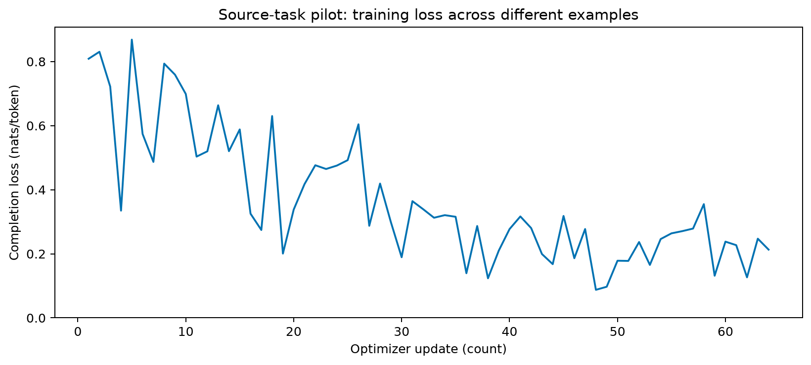
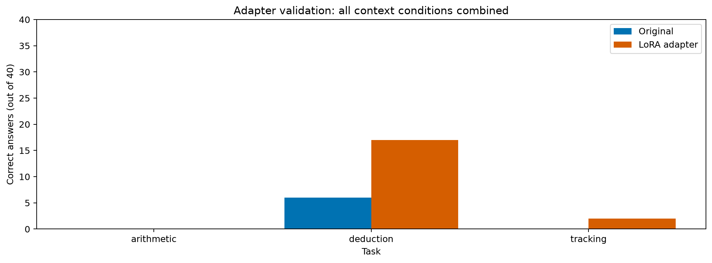

# Piloto local de dedução com distratores — 30/09/2026

## Treinamento concluído

O Qwen2.5-1.5B-Instruct recebeu 64 atualizações LoRA em 32 exemplos diferentes
de dedução, exclusivamente do treino v2.1, na condição similar. Cada exemplo
foi visto duas vezes. Aritmética e acompanhamento ficaram fora do treinamento.
Supervisão: resposta e evidências, com o prompt excluído da perda (C3).

O [protocolo](source-task-pilot-protocol.md) e a configuração foram commitados
antes da execução (`932dd34`). Não houve escolha do melhor checkpoint após
olhar a validação: o orçamento fixado foi de 64 passos.

| Medida | Resultado |
|---|---:|
| Exemplos de treino diferentes | 32 |
| Atualizações / batch | 64 / 1 |
| Tokens supervisionados acumulados | 1.906 |
| Tempo medido dentro dos passos | 16,95 s |
| Pico de memória alocada | 3,39 GiB |
| Pico de memória reservada | 4,31 GiB |
| Loss no mesmo exemplo de treino, antes / depois | 0,8088 / 0,1786 |
| Máxima diferença de logits após recarga | 0 |

O tempo exclui carregamento, salvamento e verificações dos pesos. A memória
é medida pelo PyTorch e não representa o consumo total de outros programas.
Os pesos-base permaneceram intactos; somente os adaptadores foram alterados.
A queda de loss é uma medida de treino, não uma prova de acurácia ou transferência.

Treino `f58d05c48ec99a08`. [Artefatos públicos sem pesos](../reports/2026-09-30/source-task-pilot-f58d05c48ec99a08/).

## Validação

Concluída: **19/120 acertos (15,83%)**, contra **6/120 (5%)** do modelo original.
Foram 13 transições de erro para acerto e nenhuma no sentido contrário. Foram
mantidos dados, prompts, precisão, revisão base e configurações de geração.
O teste final permanece reservado.

| Tarefa | Limpo, antes → depois | Não relacionado | Numérico | Similar | Total |
|---|---:|---:|---:|---:|---:|
| Aritmética | 0 → 0 | 0 → 0 | 0 → 0 | 0 → 0 | 0/40 → 0/40 |
| Dedução (fonte) | 3 → 6 | 1 → 3 | 2 → 5 | 0 → 3 | 6/40 → 17/40 |
| Acompanhamento (alvo) | 0 → 2 | 0 → 0 | 0 → 0 | 0 → 0 | 0/40 → 2/40 |

Cada condição contém dez casos. Os 120 casos são 30 problemas-base, cada um
em quatro condições; não são 120 observações independentes. O contrato de
conteúdo foi o mesmo antes/depois, mantendo falhas no denominador. Após o
treino todas as 120 saídas também atenderam ao JSON estrito, contra nenhuma
no baseline que respondia em Markdown. Evidências exatas: 9/120 → 21/120.

O ganho concentra-se na tarefa treinada. Os dois novos acertos em acompanhamento
ocorreram somente na condição limpa; não demonstram transferência robusta
contra distratores. Aritmética manteve efeito de piso. Melhorar formato e
acurácia nesta amostra não prova aquisição de um mecanismo geral de relevância.

Validação `df053e935dc702fd`: [respostas e métricas](../reports/2026-09-30/pilot-validation-df053e935dc702fd/).
[Transições pareadas e verificação dos controles](../reports/2026-09-30/pilot-comparison/).

## Limitações

Piloto exploratório com uma tarefa-fonte, uma semente e supervisão C3.
Faltam os controles C1/C2, repetições e intervalos de confiança. A tarefa-fonte
foi escolhida depois do diagnóstico de competência inicial. A validação tem
mudança conjunta de linguagem e profundidade em relação ao treino, portanto
erros não podem ser atribuídos exclusivamente aos distratores.

O mecanismo de checkpoints é compartilhado com o teste funcional; não foi
realizado outro ensaio de interrupção/retomada do piloto de 64 passos. A
integridade dos checkpoints e a recarga final foram verificadas nesta execução.
