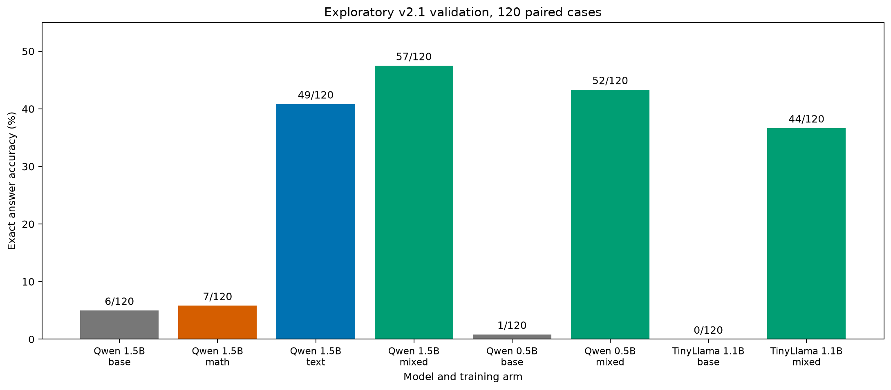

# Treinos dirigidos e balanceados — validação exploratória

O [protocolo](targeted-training-protocol-2026-09-30.md) foi registrado antes
destes cinco braços. Todos usaram somente dados de treino v2.1; os números
abaixo vêm dos mesmos 120 casos de **validação**, não do teste final anterior.
Cada tarefa tem 40 casos: dez problemas-base × quatro condições pareadas.

| Modelo / braço | Sem ajuste | Após ajuste | Aritmética / 40 | Dedução / 40 | Acompanhamento / 40 |
|---|---:|---:|---:|---:|---:|
| Qwen 1,5B, arithmetic-15b | 6/120 | 7/120 | 0 | 6 | 1 |
| Qwen 1,5B, text-15b | 6/120 | 49/120 | 0 | 32 | 17 |
| Qwen 1,5B, mixed-15b | 6/120 | **57/120** | 1 | 30 | 26 |
| Qwen 0,5B, mixed-05b | 1/120 | 52/120 | 1 | 30 | 21 |
| TinyLlama 1,1B, mixed-11b | 0/120 | 44/120 | **4** | 25 | 15 |

O melhor total é o Qwen 1,5B misto. O TinyLlama teve o maior número de
acertos aritméticos, mas 4/40 ainda é muito baixo. Treinar apenas
aritmética por 160 passos e 80 bases não produziu sequer um acerto nessa
tarefa. A hipótese de que mais exemplos da mesma supervisão bastariam para
resolver aritmética não se sustentou nesta execução.

| Braço | Limpo / 30 | Não relacionado / 30 | Numérico / 30 | Similar / 30 | Evidências exatas / 120 | JSON estrito / 120 |
|---|---:|---:|---:|---:|---:|---:|
| arithmetic-15b | 4 | 1 | 2 | 0 | 10 | 119 |
| text-15b | 19 | 11 | 9 | 10 | 21 | 119 |
| mixed-15b | 18 | 18 | 13 | 8 | 21 | 118 |
| mixed-05b | 13 | 17 | 15 | 7 | 21 | 107 |
| mixed-11b | 16 | 11 | 9 | 8 | 11 | 54 |

Nos casos aritméticos de `mixed-15b`, oito respostas selecionaram todas
as evidências exigidas, mas somente uma trouxe o número correto. No caso
limpo `v2-arithmetic-000008`, por exemplo, a resposta é
`70 − 2 − 6 − 8 − 7 = 47`; o modelo citou os cinco fatos e respondeu `59`.
Há falha de cálculo além da seleção de contexto. Em casos com distratores,
também há falha de seleção de fatos do objeto correto.

Os modelos mistos de 0,5B e 1,5B partem da mesma família Qwen2.5; o
TinyLlama 1,1B usa outra família e tokenizer. Comparar os três resultados
não isola quantidade de parâmetros. Mesmo os braços Qwen tiveram números
de parâmetros treináveis e comprimentos de sequência distintos; esses são
contrastes descritivos, com **uma semente por braço**. Os especialistas
receberam 160 passos e o misto 192; as comparações entre eles incluem
diferenças de dados e orçamento. A validação já orientou a escolha de
novos braços, portanto resultados futuros nesse mesmo split são ainda
mais exploratórios.

Os [artefatos auditáveis](../reports/2026-09-30/targeted-training/) incluem
manifestos, IDs e ordem do treino, histórico de loss, resumos de tempo e
tokens, respostas brutas, decisões de formato e comparações pareadas com
o próprio baseline de cada modelo. Checkpoints de pesos e otimizador
permanecem somente em `data/` local. A execução usou a RTX 3060 Laptop de
6 GB, BF16, geração gulosa e limite de 128 tokens.

Próxima hipótese: ensinar subtotais intermediários nos exemplos de
aritmética de treino, mantendo uma avaliação independente. Isso requer
protocolo e identificação separados; o teste final anterior continua
fechado e não será usado para selecionar a nova técnica.
