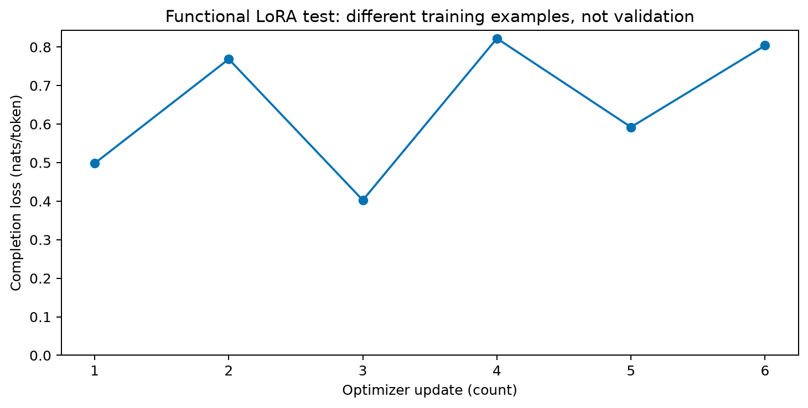

# Primeiro teste de treinamento local — 2026-09-28

O teste funcional de LoRA com Qwen2.5-1.5B-Instruct concluiu seis atualizações na RTX 3060 Laptop de 6 GB. A retomada após a terceira atualização produziu exatamente os mesmos adaptadores, estados do otimizador e perdas de uma execução contínua de controle. Os pesos-base ficaram intactos. **Não foi medida melhora de acurácia ou generalização nesta etapa.**

## Proveniência

- Código de treinamento executado: commit `4b602d6`; hash dos fontes e versões nos manifestos.
- Dataset: `data/benchmark-v2/2026-09-28/f6dd4f65804eb724/dataset.json`, gerado com seed 42, 1.200 exemplos e variantes agrupadas por problema.
- Execução retomada: `data/training/2026-09-28/c84030c401018fc4`.
- Controle contínuo: `data/training-uninterrupted/2026-09-28/c84030c401018fc4`.
- Ambos têm a mesma identidade de configuração; diretórios diferentes preservam as duas realizações. A segunda execução verifica retomada, não é outra semente científica.
- [Protocolo registrado antes da execução](benchmark-v2-and-smoke.md).

O modelo tem 1.544.259.072 parâmetros incluindo os adaptadores; somente 544.768 foram treináveis. LoRA rank 4/alpha 8 em q_proj/v_proj, pesos-base BF16, atenção eager, lote 1, AdamW com taxa 0,0001, seed 42 e gradient checkpointing não reentrante. Os seis exemplos vieram exclusivamente do treino, com pares limpo/semelhante das três tarefas. Foram supervisionados 170 tokens por execução, em sequências de 163 a 259 tokens; o limite de 512 não foi atingido.

## Verificações e medidas

| Verificação | Resultado |
|---|---|
| Hash dos pesos-base antes/depois | Igual |
| Hash dos adaptadores antes/depois | Diferente |
| Perdas, gradientes e pesos atualizados | Finitos |
| Pausa e retomada em outro processo | Passo 3 → passo 4, concluindo 6 |
| Tensor dos adaptadores: retomada vs. contínua | Igual, elemento a elemento |
| Estado do otimizador: retomada vs. contínua | Igual, incluindo momentos e contadores |
| Perdas por passo: retomada vs. contínua | Iguais |
| Recarga em modelo-base novo | Diferença máxima de logits 0 na sonda |

| Medida | Retomada | Contínua |
|---|---:|---:|
| Tempo acumulado dos passos (s) | 2,00 | 1,75 |
| Pico alocado pelo PyTorch (bytes) | 3.658.595.840 | 3.658.595.840 |
| Pico reservado pelo PyTorch (bytes) | 4.492.099.584 | 4.599.054.336 |
| Perda inicial no exemplo de treino usado como sonda | 0,498208 | 0,498208 |
| Perda final no mesmo exemplo | 0,461185 | 0,461185 |

O pico alocado foi aproximadamente 3,41 GiB e o maior reservado, 4,28 GiB. Essas medidas são do PyTorch; não incluem todos os programas usando a GPU. A duração soma somente os passos de treinamento, excluindo carregamento, sondas, hashing, gravação e recarga. A execução retomada ocorreu aproximadamente entre 00:36:10 e 00:36:31 no horário de São Paulo, incluindo a pausa/carregamento entre processos. A diferença de tempo entre duas medições tão pequenas não é um benchmark de desempenho.



Cada ponto usa um exemplo diferente. Oscilações não significam melhora ou piora da validação. A redução na sonda é sobre um exemplo treinado; não demonstra resistência a distratores ou transferência. A recarga compara a distribuição de logits em uma posição desse exemplo, não em todo o benchmark.

## Auditoria dos dados usados

Foram inspecionados manualmente os três exemplos de treino com distratores semelhantes:

| Problema | Resolução | Evidências |
|---|---|---|
| aritmética 000000 | azure: 58 + 1 − 9 − 6 = 44 | F2, F4, F5, F7 |
| dedução 000000 | ivory: P5366 → P5753 → P8100 | F1, F2, F3 |
| acompanhamento 000000 | ivory: B7981 → B6653 → B5623, tempos 0/1/2 | F4, F5, F6 |

Os gabaritos conferiram. A linguagem continua sintética e foi observado “1 marbles”, sem concordância no singular. Essa limitação foi preservada nos artefatos desta versão; deve ser corrigida em nova versão antes do benchmark definitivo. A amostra manual é pequena e composta de treino. A validação e o teste têm templates/comprimentos diferentes, e precisam de auditoria própria antes de congelar o estudo.

## Artefatos e reprodução

[Pasta pública de resultados](../reports/2026-09-28/lora-smoke/) contém manifestos, históricos, medidas, gráfico, seis exemplos de treino e a [verificação de equivalência](../reports/2026-09-28/lora-smoke/resume-verification.json). Os pesos, estados do otimizador e checkpoints completos permanecem localmente em `data/`, fora do Git. Não são necessários para ler os relatórios; são necessários para repetir a comparação de tensores sem treinar novamente.

```powershell
poetry run python scripts/export_smoke.py data/benchmark-v2/2026-09-28/f6dd4f65804eb724/dataset.json data/training/2026-09-28/c84030c401018fc4 data/training-uninterrupted/2026-09-28/c84030c401018fc4 reports/2026-09-28/lora-smoke
```

A exportação verifica integridade dos checkpoints, igualdade de configuração, correspondência dos dados e igualdade dos estados finais. Repeti-la não altera as saídas. Para treinar novamente, usar os comandos do protocolo e o código/revisões registrados.

## O que ainda falta

Auditar mais exemplos da v2, corrigir a concordância em uma nova versão e medir o baseline nessa versão antes de treinar para eficácia. Depois implementar os controles de supervisão C1/C2/C3, avaliação do adaptador em validação, orçamentos de tokens, repetições por sementes e curvas de validação. A viabilidade foi medida somente em sequências curtas, lote 1 e rank 4; não extrapolar para 512 tokens efetivos ou treinamento longo sem nova medição. Alertas de execuções longas, avaliação final, nuvem e artigo permanecem pendentes.
